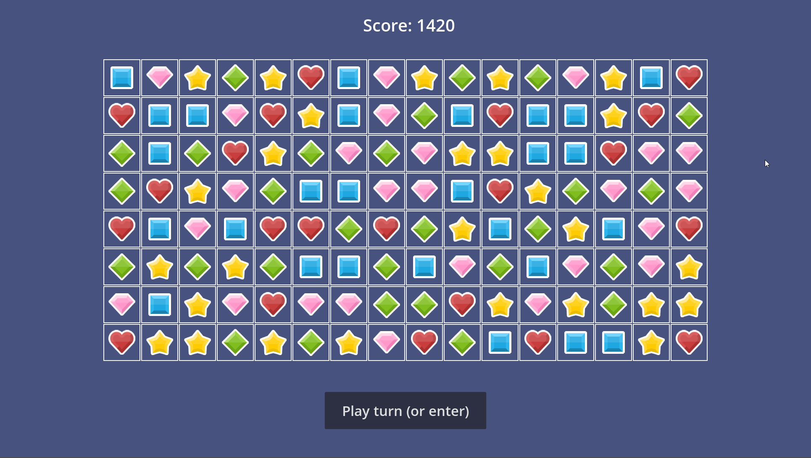

# Match Three prototype in Godot 4

Readme updated: 2022. May 18th.

## Disclaimer

This is just me praciticing and learning Godot 4. I've never used Godot or made a game before, and I only tried Unity for a brief period. So take the code and practices in this project with a grain of salt.

However, I do try to follow the and GDScript [style guide](https://docs.godotengine.org/en/latest/tutorials/scripting/gdscript/gdscript_styleguide.html) and [reference](https://docs.godotengine.org/en/latest/tutorials/scripting/gdscript/gdscript_basics.html).

## How to play

- You can move gems orthogonally any number of spaces. To do this, select two gems with the mouse and play the turn.
- You can select more than two gems to queue your moves. Your next move will play out after any chain reactions.

There's no goal or end right now. Try to predict the effect of your moves and play your turn accordingly for the biggest combo.

## Features

- Separate game event queue and animation event queue. This means that the game state already played out when the animations begin playing accordingly. That's why you can see the score for your queued moves and chain reactions added instantly to the total.
  - This queue system is what also makes queuing your moves possible.
- Weighted randomness for the gems. The red heart is half as likely to appear, but scores double.